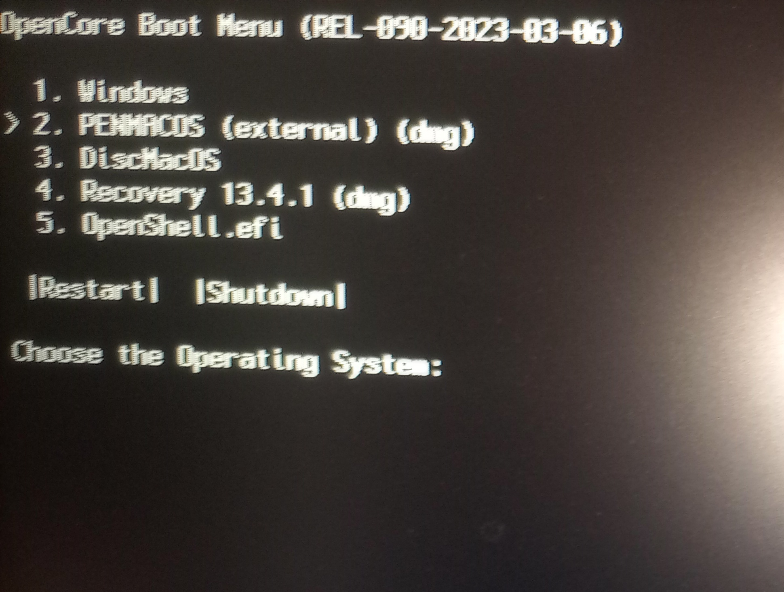
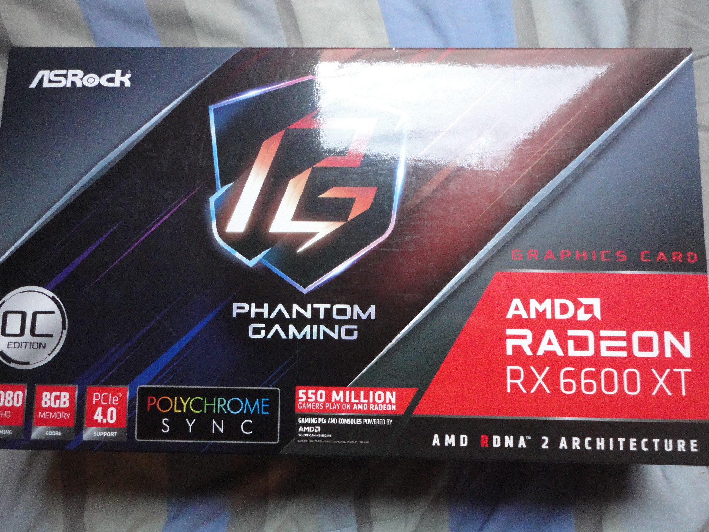
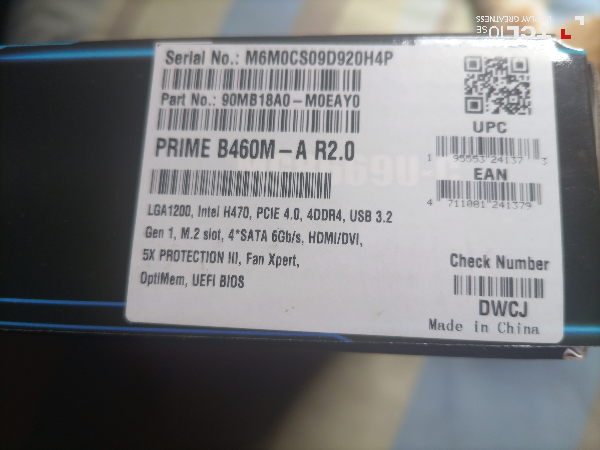
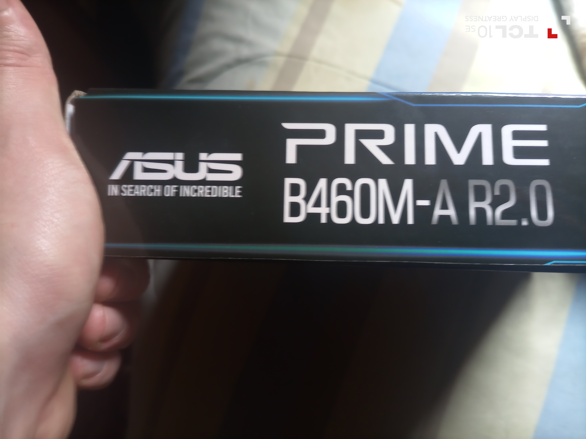

# EFI For installation of MacOS ventura with USB.

Note that there are two branches in this repository. One called USB for the EFI which goes on the USB that is used to install the OS and the other EFI called DISK is for when you have the OS installed.
The EFI DISK of the installed operating system has things that the USB installation EFI does not have since it has different configurations.
That is, once you finished installing the operating system with the EFI on the USB, you have to boot via usb, but then add the EFI to the Disk to correctly boot the macOS system always from the disk without the flash drive
Only compatible with the mother that you mentioned above, for other models you will have to investigate the whole issue of efi and opencore.

## This EFI has a basic boot interface, it is configured to install the operating system with usb, the keyboard, mouse, the cable network and starts with external graphics amd radeon the rx 6600 xt

