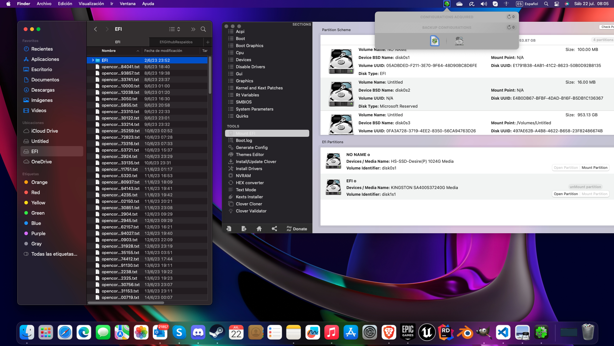

# EFI to put on the main DISK of your hackintosh once the system is installed. To mount the EFI I used Clover configurator.

Note that there are two branches in this repository. One called USB for the EFI that goes on the USB that is used to install the operating system and the other EFI called DISK is for when you have the operating system installed. The EFI DISK of the installed operating system has things that the EFI USB installation does not have since it has different configurations. That is, once you finished installing the OS with the EFI on the USB, you have to boot by usb, but then add the EFI to Disk to properly boot macOS from disk. Only compatible with the mother you mentioned above, for other models you will have to investigate the whole issue of efi and opencore. 

## This EFI has a nicer boot interface, it is configured to boot from disk. keyboard, mouse, network cable, audio and graphics work 100%. Uses Intel i5 10400f processor

## The only detail that it has is that it generates an empty .txt, I couldn't get it out, but it works very well.

## This configuration is very compatible with macOS and the graphics works 100%, tested with unreal engine 5.2

